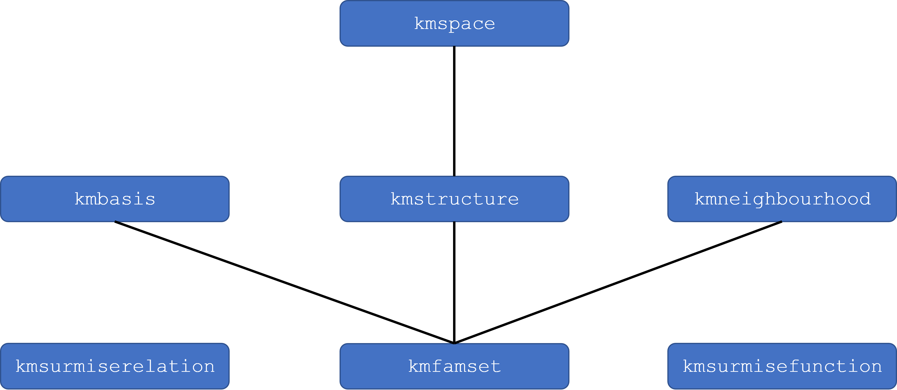

```{r setup, include = FALSE}
knitr::opts_chunk$set(
  collapse = TRUE,
  comment = "#>"
)
library(kstMatrix)
library(grDevices)
library(sets)
library(pks)
```

# Content

- [Introduction](#introduction)
- [S3 classes in `kstMatrix`](#s3-classes-in-kstmatrix)
- [Different representations for knowledge spaces](#different-representations-for-knowledge-spaces)
- [Propertiesd of knowledge spaces](#propertiesd-of-knowledge-spaces)
- [Creating trivial knowledge spaces](#creating-trivial-knowledge-spaces)
- [Simulating response patterns](#simulating-response-patterns)
- [Validating knowledge structures](#validating-knowledge-structures)
- [Assessment](#assessment)
- [Fringes and paths](#fringes-and-paths)
- [Plotting](#plotting)
- [Utilities](#utilities)
- [Datasets provided by `kstMatrix`](#datasets-provided-by-kstmatrix)
- [References](#references)

# Introduction
Knowledge space theory applies prerequisite relationships between items of knowledge
within a given domain for efficient adaptive assessment and training (Doignon & Falmagne, 
1999). The `kstMatrix` package implements some basic functions for working with
knowledge space. Furthermore, it provides several empirically obtained knowledge spaces
in form of their bases.

There is a certain overlap in functionality between the `kst`and `kstMatrix` packages, 
however the former uses a set representation and the latter a matrix representation. The
packages are to be seen as complementary, not as a replacement for each other.

This document gives a short overview on the `kstMatrix` package. For more details on the specific functions, please have a look at the manual.

Subsequently, we start with a introduction into the S3 classes used in `kstMatrix`. Afterwards,
the various functions are presented groupd by topic.

# S3 classes in `kstMatrix`
With version 2, S3 classes were introduced in `kstMatrix`. The following classes are used:

* `kmfamset`
* `kmbasis`
* `kmstructure`
* `kmspace`
* `kmneighbourhood`
* `kmsurmiserelation`
* `kmsurmisefunction`

The following figure shows the dependencies between these classes, e.g., `kmspace` being a sub-class of `kmstructure`.

<style>
  img {
    border: 0;
  }
  </style>
```{r kstMatrixClasses, echo=FALSE, fig.cap="Structure of <tt>kstMatrix</tt> classes", out.width="700"}

```

## Constructors
There exist four constructors

- `kmfamset()`
- `kmstructure()`
- `kmbasis()`
- `kmspace()`

which create the respective objects from a given matrix.

# Different representations for knowledge spaces
There exist various ways to represent knowledge spaces: the whole space itself, its basis, and the corresponding
surmise function; in case of quasi-ordinal spaces also the surmise relation. The subsequent functions allow to 
map between these representations.

## `kmbasis()`
The `kmbasis()` S3 method allows to ap different representations to bases. There are implementations for the classes
`kmsurmiserelation`, `kmsurmisefunction`, and `matrix`, the latter aiming at `kmfamset`s including `kmstructure`s 
and `kmspace`s.

## `kmsf2basis()`
This function determines a basis from a surmise function.

## `kmSR2basis()`
This function creates a basis from a surmise relation.

## `kmsurmisefunction()`
This function takes an arbitrary `kmfamset` (family of sets) and determines the surmise function of the smallest
knowledge space containing this family of sets, i.e. its closure under union.

## `kmsurmiserelation()`
This function determines the surmise relation for a quasi-ordinal knowledge space. If the parameter is an arbitrary
`kmfamset`, the result is the surmise relation for the smalest quasi-ordinal knowledge space containing the family 
of sets, i.e. its closure under union *and* intersection.

## `kmunionclosure()`
This function returns the closure under union (i.e. a knowledge space) of a family of sets.

# Properties of knowledge spaces
There are `kmeqreduction()` and `kmnotions()` for dealing with equivalent items. The former reduces a famset
to the structure on its notions, and the latter gives the notions itself.

Another point is the weelgradedness - `kmiswellgraded()`tests if a structure fulfils this condition.

# Creating trivial knowledge spaces
For a given item number, there are two trivial knowledge spaces, the maximal knowledge
space representing absolutely no prerequisite relationships (the knowledge space is the 
power set of the item set and the basis matrix is the diagonal matrix), and the minimal
knowledge space representing equivalence of all items (the knowledge space contains just 
the empty set and the full item set, and the basis matrix contains one line full of '1's).

# Simulating response patterns
Response patterns are simulated by `kmsimulate()` applying the BLIM (Basic Local
Independence Model). It assumes identical $\beta$ and $\eta$ values for all items. 

More elaborated functions may follow.

# Validating knowledge structures
There exist two core functions for validation. `kmvalidate()` determines validity indices based on the states in the
knowledge structure, and `kmSRvalidate()`determines indices based on the surmise relation of a quasi-ordinal knowledge space.
Furthermore, there is a helpüer function `kmdist()` ehich returns a distance distribution.

# Assessment
There exist several functions in the assessment context. They are all based on a paper by Falmagne & Doignon (1988,
see also Doignon & Falmagne, 1999, Chapter 10).

The core functiuon is `kmassess()`. It does a complete assessmednt for a given response vector and a given 
knowledge structure. A simplified version is `kmsassess()` where the originally item-specific parameters are identical
for all items.

Both these functions rely on alternative question and update rules realised by `kmassesshalfsplit()` and
`kmassessinfomrative()` and by `kmassessbayesian()` and `kmassessmultipöicatiuve()`, respectively. The separation of 
these functions allows also for a use in an interactive system, e.g., a Shiny app.

Finally, there is `kmassessmentsimulation()` which does assessments for a whole dataset of response patterns and 
produces a table which could be further evaluated statistically.

# Fringes and Paths
Well-graded learning paths are an important concept in knowledge space theory. With `kmlearningpaths()`, we obtain a 
collection of all learning paths in a knowledge structure, with `kmgradations()` a collection of all gradations
between two states in a structure. In this context also `kmiswellgraded()` should be mentioned which tests if a
structure is well-graded.

In mthis context, we may also need fringes and neighbourhoods. The former can be determined with `kmfringe()`, `kminnerfringe()`,
and `kmouterfringe()`. For the latter, there are the functions `kmneighbourhood()` (determining the 1-neighbourhood of a state)
and `kmnneighbourhood()` (determining an arbitrary n-neighbourhood).

# Plotting 
With version 2.0  of `kstMatrix`, plotting functionality is provided through the S3 `plot` 
method. The method is available for the `kmfamset`,  `kmsurmiserelation`, and `kmneidghbourhood` classes.
```{r}
plot(xpl$space)
plot(xpl$sr)
```
`plot` uses the `DiagrammeR` package which in turn uses the `Graphviz` software. The default parameters are slightly different for `kmfamset`s and `kmsurmiserelation`s. 
```{r}
plot(xpl$sr, colors="#aaffaa", vertexshape="box")
```
For plotting neighbourhoods, by default three different colors are used.
```{r}
plot(kmneighbourhood(c(1,1,0,0), xpl$space, include=TRUE), state=c(1,1,0,0), edgelabel=TRUE)
```

# Utilities
This group contains several smaller helper functions.

- `kmsymmsetdiff()`
- `kmsetdistance()`
- `kmsetiselement()`
- `kmdoubleequal()`
- `kmcolors()`

# Datasets provided by `kstMatrix`
## Empirical structures
The provided empirical datasets were obtained by the research group around Cornelia Dowling through querying experts
in the respective fields. 

### cad
Six experts were queried about prerequisite relationships between 28 AutoCAD
knowledge items (Dowling, 1991; 1993a). A seventh basis represents those
prerequisite relationships on which the majority (4 out of 6) of the experts
agree (Dowling & Hockemeyer, 1998).

### fractions
Three experts were queried about prerequisite relationships between 77 items
on fractions (Baumunk & Dowling, 1997). A fourth basis represents those
prerequisite relationships on which the majority of the experts agree
(Dowling & Hockemeyer, 1998).

### readwrite
Three experts were queried about prerequisite relationships between 48 items
on reading and writing abilities (Dowling, 1991; 1993a). A fourth basis represents
those prerequisite relationships on which the majority of the experts agree
(Dowling & Hockemeyer, 1998).

## Example structures
### phsg
A small knowledge space on a set of seven items on linear functions. This example
is used in a manuscript by Steiner et al.


### xpl
This is just a small fictitious 4-item-example used for the examples in the
documentation. Please note that this knowledge space is not quasi-ordinal.

# References
- Baumunk, K. & Dowling, C. E. (1997). Validity of spaces for assessing knowledge 
  about fractions. _Journal of Mathematical Psychology, 41,_ 99–105.
- Doignon, J.-P. & Falmagne, J.-C. (1999). _Knowledge Spaces._ Springer–Verlag, Berlin.
- Dowling, C. E. (1991). _Constructing Knowledge Structures from the Judgements of Experts._ 
  Habilitationsschrift, Technische Universität Carolo-Wilhelmina, Braunschweig, Germany.
- Dowling, C. E. (1993a). Applying the basis of a knowledge space for controlling the
  questioning of an expert. _Journal of Mathematical Psychology, 37,_ 21–48.
- Dowling, C. E. (1993b). On the irredundant construction of knowledge spaces.
  Journal of Mathematical Psychology, 37, 49–62.
- Dowling, C. E. & Hockemeyer, C. (1998). Computing the intersection of knowledge spaces using only 
  their basis. In Cornelia E. Dowling, Fred S. Roberts, & Peter Theuns, editors,
  _Recent Progress in Mathematical Psychology,_ pp. 133–141. Lawrence Erlbaum
  Associates Ltd., Mahwah, NJ.
- Falmagne J.-C. & Doignon J.-P. (1988). A class of stochastic procedures for the assessment of knowledge. 
  _British Journal of Mathematical and Statistical Psychology, 41,_ 1–23. 
